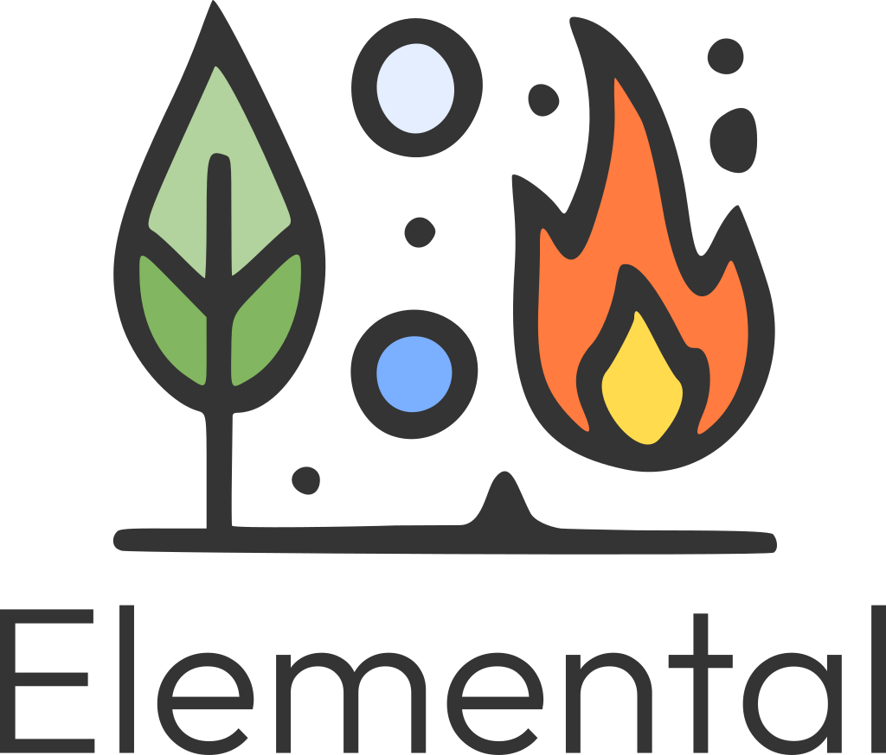

<div align="center"> 
 
</div>

---

Elemental is a general-purpose, multi-agent framework for automating tasks using AI agents composed in teams for conversation-based collaboration. Agents can use language models from various providers (including small models in local environment), allowing more flexible environment choice and isolation of work from external infrastructure if needed. Leading LLMs are also supported. Agents are equipped with tools that allow them to interact with external systems (internal and provided with MCP servers). Elemental allows for various configurations including simple assistant, isolated agent, multi-agent teams and workflows or multi-agent teams. The agent configuration is dynamic, with the ability to planning work, replanning tasks.

## Features

- Multi-agent task execution.
- Custom language model per agent (including different inference engines and size of the model - direct support for Ollama, Llama.cpp, OpenAI and compatible APIs, Anthropic).
- Simple model selection per agent e.g. `ollama|gemma3` or `openai|gpt-4.1-mini`.
- Customizable templates with variables in Jinja format.
- Default dynamic orchestrator with dynamic planning, execution, re-planning, composition and verification steps.
- Simple command line interface with agent configuration provided by YAML file.
- Tool execution with extendable interface to provide native tools executable with any language model.
- Reasoning and conversational agent prompt strategies.
- MCP Tools with complete toolset or individual tool level selection.

<!-- ## Getting started

### Requirements 

### Installation 

```
pip install elemental-agents
```

#### Install from sources

```
git clone git@github.com:AttoAgents/elemental.git
cd elemental
poetry build
pip install dist/elemental-*.whl
```

#### Precompiled package directly from Github

```
pip install git...
```

## Configuration


## Examples

### Simple assistant

```python
from elemental_agents.core.agent.agent_factory import AgentFactory

factory = AgentFactory()
assistant = factory.create('AssistantAgent', 'Simple','ollama|gemma3')
result = assistant.run('Why is the sky blue?')
```

### ReAct agent

```python
from elemental_agents.core.agent.agent_factory import AgentFactory

factory = AgentFactory()
assistant = factory.create(
        agent_name='AssistantAgent',
        agent_type='ReAct',
        llm='openai|gpt-4.1-mini'
    )
result = assistant.run('Why is the sky blue?')
```

### ReAct agent with internal planning (PlanReAct)

```python
from elemental_agents.core.agent.agent_factory import AgentFactory

factory = AgentFactory()
assistant = factory.create(
        agent_name='AssistantAgent',
        agent_type='ReAct',
        llm='openai|gpt-4.1-mini'
    )
result = assistant.run('Why is the sky blue?')
```

### Agent Team

```python
from elemental_agents.core.agent.agent_factory import AgentFactory
from elemental_agents.core.agent_team.agent_team import AgentTeam

factory = AgentFactory()

assistant = factory.create(
        agent_name='AssistantAgent',
        agent_type='ConvPlanReAct',
        agent_persona='Act as helpful assistant.'
        llm='openai|gpt-4.1-mini'
    )
programmer = factory.create(
        agent_name='AssistantAgent',
        agent_type='ConvPlanReAct',
        agent_persona='Skillful programmer.'
        llm='ollama|gemma3'
)

agent_team = AgentTeam(
        selector=ConversationalSelector(lead_agent='AssistantAgent')
    )
agent_team.register_agent(assistant)
agent_team.register_agent(programmer)

agent_team.run(task='What is the color of sky on Mars?')
```

### Agent team with external planning (task queue)

### User input file - YAML configuration of agent team

### Tools usage and user provided tools

```python
from elemental_agents.core.agent.agent_factory import AgentFactory

factory = AgentFactory()
assistant = factory.create(
        agent_name='AssistantAgent', 
        agent_type='PlanReAct',
        llm='openai|gpt-4.1-mini',
        toolbox=[
            'ReadFiles',
            'WriteFile',
            'NoAction'
        ]
    )
result = assistant.run('Why is the sky blue?')
```

### Model Context Protocol tools

```python
from elemental_agents.core.agent.agent_factory import AgentFactory

factory = AgentFactory()
assistant = factory.create(
        agent_name='AssistantAgent', 
        agent_type='ReAct',
        llm='openai|gpt-4.1-mini',
        toolbox=[
            'ReadFiles',
            'WriteFile',
            'MCP|Github|list_issues', 
            'MCP|Github|search_repository'
        ]
    )
result = assistant.run('Why is the sky blue?')
```

`.env` must here include the `mcpConfig` with Github MCP defined. To include all tools from the MCP server in addition (or not) to internal tools use `MCP|Github|*`.

```python
from elemental_agents.core.agent.agent_factory import AgentFactory

factory = AgentFactory()
assistant = factory.create(
        agent_name='AssistantAgent', 
        agent_type='ReAct',
        llm='openai|gpt-4.1-mini',
        toolbox=[
            'ReadFiles',
            'WriteFile',
            'MCP|Github|*'
        ]
    )
result = assistant.run('Why is the sky blue?')
``` -->

## Contact
The project is developed and maintained by AttoAgents, for information please contact us at <info@attoagents.io>.
